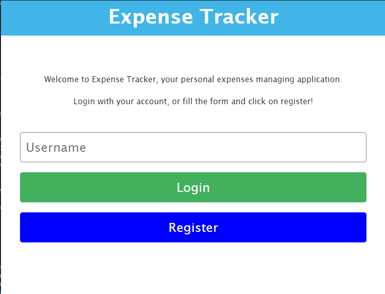
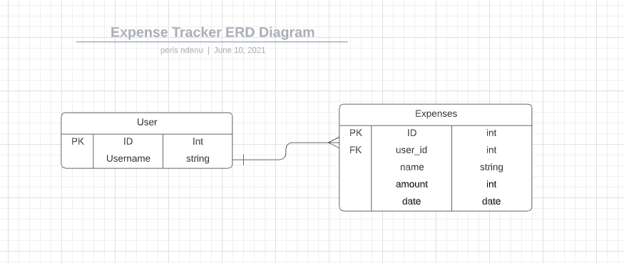

# Portfolio Tracker

> A Simple Expense tracker app built with React & [Rails API](https://github.com/mimipeshy/expense-tracker).

## Snapshots

## Presentations

- View the live version [HERE](https://peris-expense-tracker.netlify.app)
- View the project walkthrough [HERE](https://www.loom.com/share/40c7b17100324c5cbb04a6e2bd5fd414)

## Rails Backend API Association Diagram

## Built With

- React & Redux
- Rails for API
- Enzyme & Jest for Testing

## Deployment

1. Clone the repo `git clone https://github.com/mimipeshy/expense-tracker-react.git`
2. run `npm run i` to install dependencies
3. run `npm start` to start the server
4. Open `http://localhost:3000/`
5. Enjoy :)

## Testing

1. Run `npm test`

## Authors

👤 **Peris Ndanu**

- GitHub: [@mimipeshy](https://github.com/mimipeshy)
- Twitter: [@pygirl254](https://twitter.com/pygirl254)
- LinkedIn: [peris-ndanu](https://www.linkedin.com/in/peris-ndanu-405083193/)

## 🤝 Contributing

Contributions, issues and feature requests are welcome!

Feel free to check the [issues page](https://github.com/mimipeshy/expense-tracker-react/issues).

## Show your support

Give a ⭐️ if you like this project!

## Acknowledgments

- Microverse
- [Gregoire Vella](https://www.behance.net/gregoirevella) for [design idea](https://www.behance.net/gallery/13271423/Bodytrackit-An-iOs-app-Branding-UX-and-UI)

